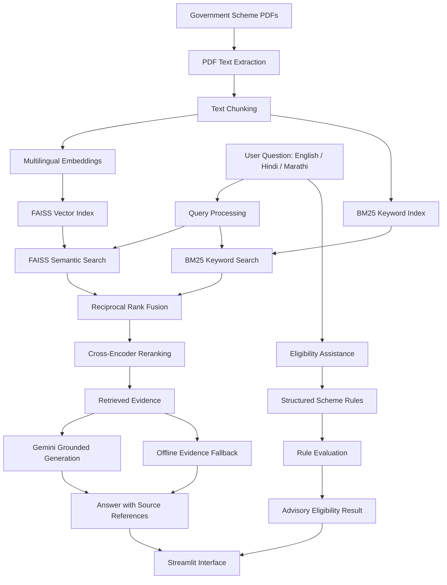

# YojanaRAG System Architecture

```mermaid
flowchart TD
    A[Government Scheme PDFs] --> B[PDF Text Extraction]
    B --> C[Text Chunking]
    C --> D[Multilingual Embeddings]
    D --> E[FAISS Vector Index]
    C --> F[BM25 Keyword Index]

    U[User Question: English / Hindi / Marathi] --> G[Query Processing]
    G --> H[FAISS Semantic Search]
    G --> I[BM25 Keyword Search]
    E --> H
    F --> I

    H --> J[Reciprocal Rank Fusion]
    I --> J
    J --> K[Cross-Encoder Reranking]
    K --> L[Retrieved Evidence]
    L --> M[Gemini Grounded Generation]
    M --> N[Answer with Source References]

    L --> O[Offline Evidence Fallback]
    O --> N

    U --> P[Eligibility Assistance]
    P --> Q[Structured Scheme Rules]
    Q --> R[Rule Evaluation]
    R --> S[Advisory Eligibility Result]

    N --> T[Streamlit Interface]
    S --> T
```
